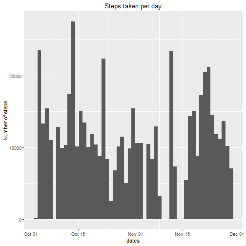
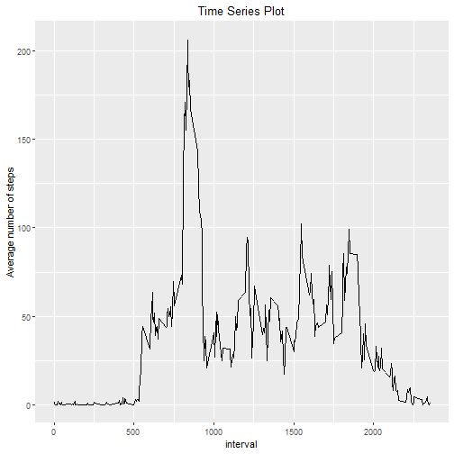
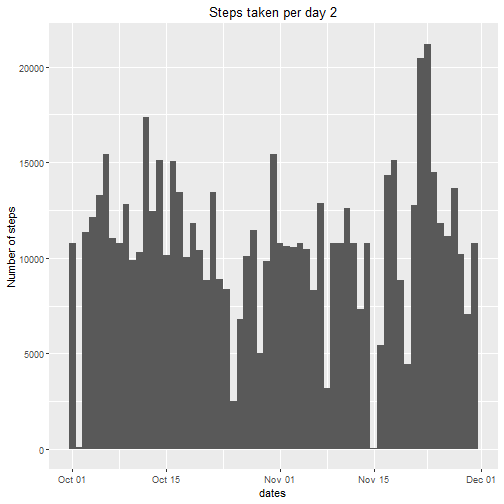
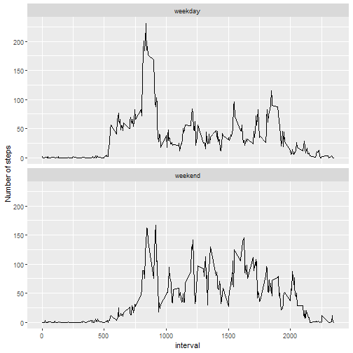

Reproducible research wk 2
==========================
Author: Adegboyega Ajenifuja
----------------------------
Output: html
------------
Date: 10th September 2019
----------------------------


Below is a code chunk to read in the required data


```r
activity1 <- read.csv("activity.csv", header = TRUE, sep = ",", na.strings = "NA", stringsAsFactors = FALSE)
```

This code chunk changes the class of the date column within the dataset to a date class and sets the date format


```r
activity1$date <- as.Date(activity1$date, format = "%Y-%m-%d")
```

The following chunk extracts the portion of the activity dataset without NA values 


```r
activity1_noNA <- activity1[!is.na(activity1$steps),]
head(activity1_noNA)
```

```
##     steps       date interval
## 289     0 2012-10-02        0
## 290     0 2012-10-02        5
## 291     0 2012-10-02       10
## 292     0 2012-10-02       15
## 293     0 2012-10-02       20
## 294     0 2012-10-02       25
```

What is mean total number of steps taken per day?
-------------------------------------------------

1. Calculate the total number of steps taken per day


```r
steps_per_day <- aggregate(steps ~ date, activity1_noNA, sum)
steps_per_day
```

```
##          date steps
## 1  2012-10-02   126
## 2  2012-10-03 11352
## 3  2012-10-04 12116
## 4  2012-10-05 13294
## 5  2012-10-06 15420
## 6  2012-10-07 11015
## 7  2012-10-09 12811
## 8  2012-10-10  9900
## 9  2012-10-11 10304
## 10 2012-10-12 17382
## 11 2012-10-13 12426
## 12 2012-10-14 15098
## 13 2012-10-15 10139
## 14 2012-10-16 15084
## 15 2012-10-17 13452
## 16 2012-10-18 10056
## 17 2012-10-19 11829
## 18 2012-10-20 10395
## 19 2012-10-21  8821
## 20 2012-10-22 13460
## 21 2012-10-23  8918
## 22 2012-10-24  8355
## 23 2012-10-25  2492
## 24 2012-10-26  6778
## 25 2012-10-27 10119
## 26 2012-10-28 11458
## 27 2012-10-29  5018
## 28 2012-10-30  9819
## 29 2012-10-31 15414
## 30 2012-11-02 10600
## 31 2012-11-03 10571
## 32 2012-11-05 10439
## 33 2012-11-06  8334
## 34 2012-11-07 12883
## 35 2012-11-08  3219
## 36 2012-11-11 12608
## 37 2012-11-12 10765
## 38 2012-11-13  7336
## 39 2012-11-15    41
## 40 2012-11-16  5441
## 41 2012-11-17 14339
## 42 2012-11-18 15110
## 43 2012-11-19  8841
## 44 2012-11-20  4472
## 45 2012-11-21 12787
## 46 2012-11-22 20427
## 47 2012-11-23 21194
## 48 2012-11-24 14478
## 49 2012-11-25 11834
## 50 2012-11-26 11162
## 51 2012-11-27 13646
## 52 2012-11-28 10183
## 53 2012-11-29  7047
```

The following chunk creates a one column dataframe of dates with each date repeated according to the number of steps taken on that day


```r
dates_rep <- data.frame(dates = rep(steps_per_day$date, times = steps_per_day$steps))
head(dates_rep)
```

```
##        dates
## 1 2012-10-02
## 2 2012-10-02
## 3 2012-10-02
## 4 2012-10-02
## 5 2012-10-02
## 6 2012-10-02
```

2. Make a histogram of the total number of steps taken each day


```r
library(ggplot2)
```

```
## Registered S3 methods overwritten by 'ggplot2':
##   method         from 
##   [.quosures     rlang
##   c.quosures     rlang
##   print.quosures rlang
```

```r
ggplot(dates_rep, aes(dates)) + geom_histogram(bins = 53) + ggtitle("Steps taken per day") + ylab("Number of steps") + theme(plot.title = element_text(hjust = 0.5))
```



3. Calculate and report the mean and median of the total number of steps taken per day


```r
Mean <- mean(steps_per_day$steps)
Mean
```

```
## [1] 10766.19
```

```r
Median <- median(steps_per_day$steps)
Median
```

```
## [1] 10765
```

What is the average daily activity pattern?
-------------------------------------------

The chunk below creates a 2 column dataframe of the 5 minute interval and the number of steps taken in that interval averaged across all days


```r
time_series <- aggregate(steps ~ interval, activity1_noNA, mean)
head(time_series)
```

```
##   interval     steps
## 1        0 1.7169811
## 2        5 0.3396226
## 3       10 0.1320755
## 4       15 0.1509434
## 5       20 0.0754717
## 6       25 2.0943396
```

1. Make a time series plot (i.e.type = "l") of the 5-minute interval (x-axis) and the average number of steps taken, averaged across all days (y-axis)


```r
ggplot(time_series, aes(interval, steps)) + geom_line() + ggtitle("Time Series Plot") + ylab("Average number of steps") + theme(plot.title = element_text(hjust = 0.5))
```



2. Which 5-minute interval, on average across all the days in the dataset, contains the maximum number of steps?


```r
subset(time_series, steps == max(time_series$steps), select = interval)
```

```
##     interval
## 104      835
```

Imputing missing values
-----------------------

1. Calculate and report the total number of missing values in the dataset (i.e. the total number of rows with NAs)


```r
activity1_TF <- !complete.cases(activity1)
activity1_NA <- activity1[activity1_TF,]
nrow(activity1_NA)
```

```
## [1] 2304
```

2. Devise a strategy for filling in all of the missing values in the dataset. The strategy does not need to be sophisticated. For example, you could use the mean/median for that day, or the mean for that 5-minute interval, etc.

The strategy to be used will be the mean of values for the respective interval


The code chunk below creates a data frame from the original activity data frame by computing the mean of steps taken for each interval over the entire period, while omitting NA values.


```r
interval_mean <- aggregate(steps ~ interval, activity1, mean, na.rm = TRUE)
head(interval_mean)
```

```
##   interval     steps
## 1        0 1.7169811
## 2        5 0.3396226
## 3       10 0.1320755
## 4       15 0.1509434
## 5       20 0.0754717
## 6       25 2.0943396
```

The code chunk below populates the NA values in the activity_NA dataframe(subset of activity data frame containing data with NA values)with the means from the interval_mean dataframe


```r
activity1_NA$steps <- interval_mean$steps[match(interval_mean$interval, activity1_NA$interval)]
```

3. Create a new dataset that is equal to the original dataset but with the missing data filled in.

The code chunk below binds the activity1_noNA dataframe(subset of activity dataframe without missing values) with the newly populated activity1_NA dataframe to give a new dataframe


```r
activity2 <- rbind(activity1_noNA, activity1_NA)
head(activity2)
```

```
##     steps       date interval
## 289     0 2012-10-02        0
## 290     0 2012-10-02        5
## 291     0 2012-10-02       10
## 292     0 2012-10-02       15
## 293     0 2012-10-02       20
## 294     0 2012-10-02       25
```

4a. Make a histogram of the total number of steps taken each day and Calculate and report the mean and median total number of steps taken per day.

The code chunk below creates first a dataframe of steps taken per day and then another of dates with each date repeated according to the number of steps taken on that day. Finally, a plot of the number of steps taken each day

```r
steps_per_day2 <- aggregate(steps ~ date, activity2, sum)
dates_rep2 <- data.frame(dates = rep(steps_per_day2$date, times = steps_per_day2$steps))
ggplot(dates_rep2, aes(dates)) + geom_histogram(bins = 61) + ggtitle("Steps taken per day 2") + ylab("Number of steps") + theme(plot.title = element_text(hjust = 0.5))
```



The code chunk below calculates the mean and median of total number of steps taken per day

```r
Mean2 <- mean(steps_per_day2$steps)
Mean2
```

```
## [1] 10766.19
```

```r
Median2 <- median(steps_per_day2$steps)
Median2
```

```
## [1] 10766.19
```

4b. Do these values differ from the estimates from the first part of the assignment? 

The mean shows a slight decrease from the first part of the assignment but the median shows a slight increase of 2 steps

4c. What is the impact of imputing missing data on the estimates of the total daily number of steps?

There is an evident increase in the total daily steps of some days in October.


Are there differences in activity patterns between weekdays and weekends?
-------------------------------------------------------------------------

1. Create a new factor variable in the dataset with two levels – “weekday” and “weekend” indicating whether a given date is a weekday or weekend day.

The chunk below first, creates a variable "weekday" holding days Monday to Friday, then adds the Column Day.Type to the dataframe with imputted missing values which specifies if the date is a weekday or a weekend

```r
weekday <- c("Monday", "Tuesday", "Wednesday", "Thursday", "Friday")
activity2$Day.Type <- factor(ifelse(weekdays(activity2$date) %in% weekday, yes = "weekday", no = "weekend"))
head(activity2)
```

```
##     steps       date interval Day.Type
## 289     0 2012-10-02        0  weekday
## 290     0 2012-10-02        5  weekday
## 291     0 2012-10-02       10  weekday
## 292     0 2012-10-02       15  weekday
## 293     0 2012-10-02       20  weekday
## 294     0 2012-10-02       25  weekday
```

2. Make a panel plot containing a time series plot (i.e.type="l") of the 5-minute interval (x-axis) and the average number of steps taken, averaged across all weekday days or weekend days (y-axis). See the README file in the GitHub repository to see an example of what this plot should look like using simulated data.

The code chunk below creates a dataframe of the average number of steps taken at each interval for weekdays and weekends and then makes the time-series plot

```r
time_series2 <- aggregate(steps ~ interval+Day.Type, data = activity2, mean)
colnames(time_series2) <- c("interval", "Day.Type", "mean.steps")
ggplot(time_series2, aes(interval, mean.steps)) + geom_line() + facet_wrap(.~Day.Type,ncol = 1, strip.position = "top") + ylab("Number of steps")
```


